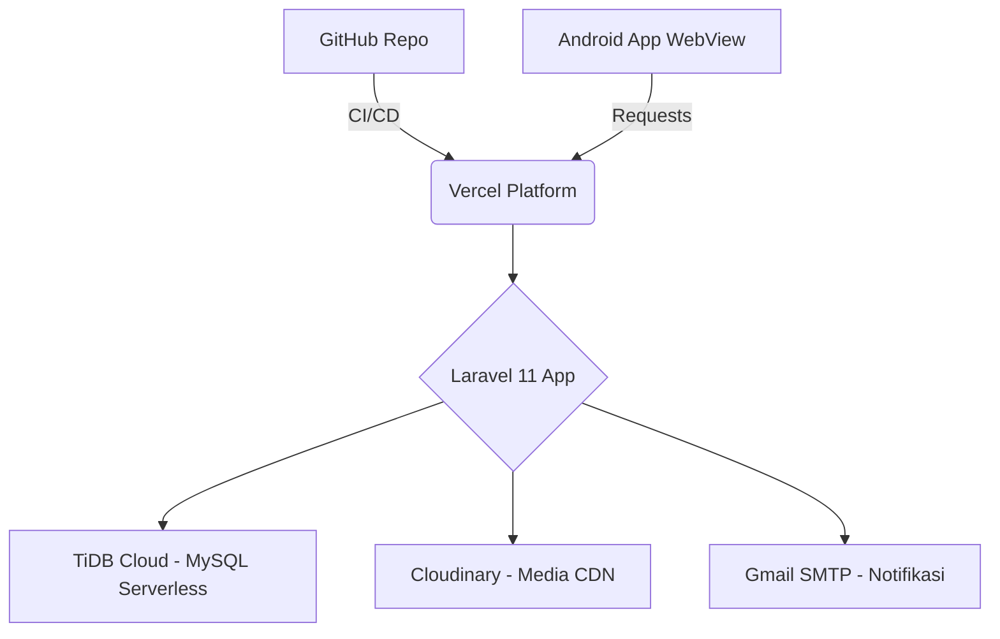
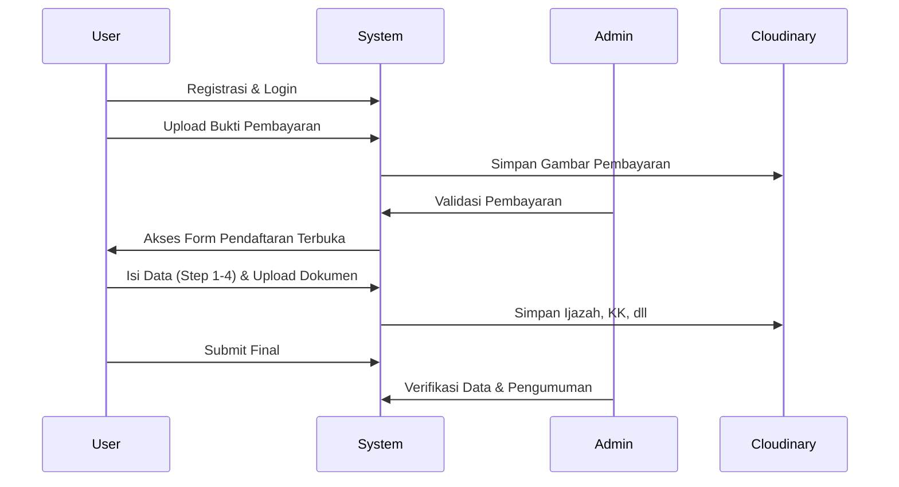

# Sistem Informasi Profil Pondok Pesantren & PPDB Online
### 🛡️ Pondok Pesantren Modern Darul Azhar

[](https://laravel.com)
[](https://pingcap.com/products/tidb)
[](https://cloudinary.com)
[](https://vercel.com)

Aplikasi ini merupakan solusi digitalisasi modern untuk Pondok Pesantren, mencakup pengelolaan profil lembaga hingga sistem Penerimaan Peserta Didik Baru (PPDB) yang terintegrasi. Dikembangkan dengan konsep **Hybrid App (WebView)**, memungkinkan akses cepat melalui browser maupun aplikasi Android.

---

## 🚀 Fitur Utama

- **Profil Ponpes Dinamis**: Informasi lengkap mengenai sejarah, visi-misi, program unggulan, dan fasilitas pesantren.
- **Sistem PPDB Online**: Alur pendaftaran mandiri dari registrasi, pembayaran, hingga pengisian formulir multi-step.
- **Manajemen Dokumen**: Upload dokumen persyaratan (Ijazah, KK, Akta) secara digital.
- **Admin Dashboard**: Panel kontrol untuk validasi pembayaran, verifikasi data pendaftar, dan publikasi pengumuman hasil seleksi.
- **Mobile Optimized**: Antarmuka responsif yang dioptimalkan untuk akses via WebView di perangkat Android.

---

## 🏗️ Arsitektur Cloud (Modern Architecture)

Proyek ini menggunakan arsitektur *Cloud-Native* untuk memastikan skalabilitas dan efisiensi resource:



### Alur Integrasi:
1.  **CI/CD**: Setiap perubahan kode di **GitHub** akan otomatis di-deploy oleh **Vercel**.
2.  **Database**: Menggunakan **TiDB Cloud** (Serverless MySQL) yang menjamin data tetap aman dan *highly available* tanpa pusing manajemen infrastruktur database.
3.  **Storage**: Foto profil dan dokumen pendaftar disimpan secara eksternal di **Cloudinary** untuk mengurangi beban server utama.

---

## 🛠️ Teknologi yang Digunakan

| Komponen | Teknologi | Keterangan |
| :--- | :--- | :--- |
| **Backend** | Laravel 11 | Framework PHP modern dengan keamanan tingkat tinggi. |
| **Database** | TiDB Cloud | MySQL Compatible Serverless Database. |
| **Media Storage** | Cloudinary | API-based Image & Video Management. |
| **Deployment** | Vercel | Serverless hosting untuk performa ultra cepat. |
| **Frontend** | Blade & Tailwind CSS | Template engine Laravel & Utility-first CSS. |
| **Android App** | Java/Kotlin WebView | Wrapper Android untuk akses mobile yang ringan. |

---

## 💡 Alasan Pemilihan Stack

- **TiDB Cloud (Scalability)**: Memilih database Serverless memastikan aplikasi siap menangani lonjakan pendaftar PPDB kapan saja tanpa perlu menyewa server VPS mahal di awal.
- **Cloudinary (Optimized Media)**: Penanganan upload dokumen dan foto seringkali membebani server. Cloudinary secara otomatis melakukan kompresi hibrida dan optimasi format (WebP/AVIF) agar aplikasi tetap ringan diakses dari HP.

---

## 🔄 Logic Flow (Alur Sistem PPDB)

Berikut adalah alur pendaftaran siswa baru dalam sistem ini:



---

## ⌨️ Cuplikan Program (Technical Implementation)

### 1. Konfigurasi TiDB Cloud (Serverless)
Koneksi database dilakukan melalui SSL untuk menjamin keamanan transmisi data ke Cloud.
```php
// configuration in .env
DB_CONNECTION=mysql
DB_HOST=gateway01.ap-southeast-1.prod.aws.tidbcloud.com
DB_PORT=4000
DB_DATABASE=db_ponpes
MYSQL_ATTR_SSL_CA=tidb-ca.pem
```

### 2. Integrasi Cloudinary Storage
Logika penyimpanan dokumen pendaftar menggunakan Cloudinary Laravel package:
```php
public function storeStep3(Request $request) {
    if ($request->hasFile('photo')) {
        $storage = Storage::disk('cloudinary');
        $path = $storage->putFile('ppdb/photos', $request->file('photo'));
        $registration->photo_url = $storage->url($path);
    }
    $registration->save();
}
```

### 3. Deployment Konfigurasi (vercel.json)
Konfigurasi entry point untuk menjalankan Laravel di lingkungan Serverless PHP Vercel.
```json
{
  "version": 2,
  "builds": [
    { "src": "api/index.php", "use": "vercel-php@latest" },
    { "src": "/public/**", "use": "@vercel/static" }
  ],
  "routes": [
    { "src": "/(.*)", "dest": "/api/index.php" }
  ]
}
```

### 4. Hybrid App Implementation (Android WebView)
Wrapper Android menggunakan Java untuk menampilkan aplikasi web dalam format aplikasi mobile.
```java
// android/app/src/main/java/com/darelazhar/app/MainActivity.java
public class MainActivity extends AppCompatActivity {
    private final String targetUrl = "https://pon-pes-darel-azhar-id.vercel.app";
    
    @Override
    protected void onCreate(Bundle savedInstanceState) {
        super.onCreate(savedInstanceState);
        webView.getSettings().setJavaScriptEnabled(true);
        webView.loadUrl(targetUrl);
    }
}
```

### 5. CI/CD Pipeline (GitHub Actions)
Automasi pengujian unit sebelum kode didorong ke heroku/vercel untuk menjaga stabilitas.
```yaml
# .github/workflows/laravel-ci.yml
name: Laravel CI
on: [push]
jobs:
  tests:
    runs-on: ubuntu-latest
    steps:
      - uses: actions/checkout@v4
      - name: Run Tests
        run: php artisan test
```

---

## 🛠️ Instalasi Lokal

1.  **Clone Repository**
    ```bash
    git clone https://github.com/username/sekolah-app.git
    cd sekolah-app
    ```
2.  **Install Dependencies**
    ```bash
    composer install
    npm install && npm run build
    ```
3.  **Konfigurasi Environment**
    Salin `.env.example` ke `.env` dan lengkapi API Key berikut:
    - `DB_HOST`, `DB_PASSWORD` (Dari TiDB Console)
    - `CLOUDINARY_API_KEY`, `CLOUDINARY_API_SECRET` (Dari Cloudinary Dashboard)
4.  **Generate Key & Migrate**
    ```bash
    php artisan key:generate
    php artisan migrate
    ```

---

**Dibuat oleh [Nama Anda/Tim] - Tugas Kuliah Pengembangan Aplikasi Berbasis Web.**
